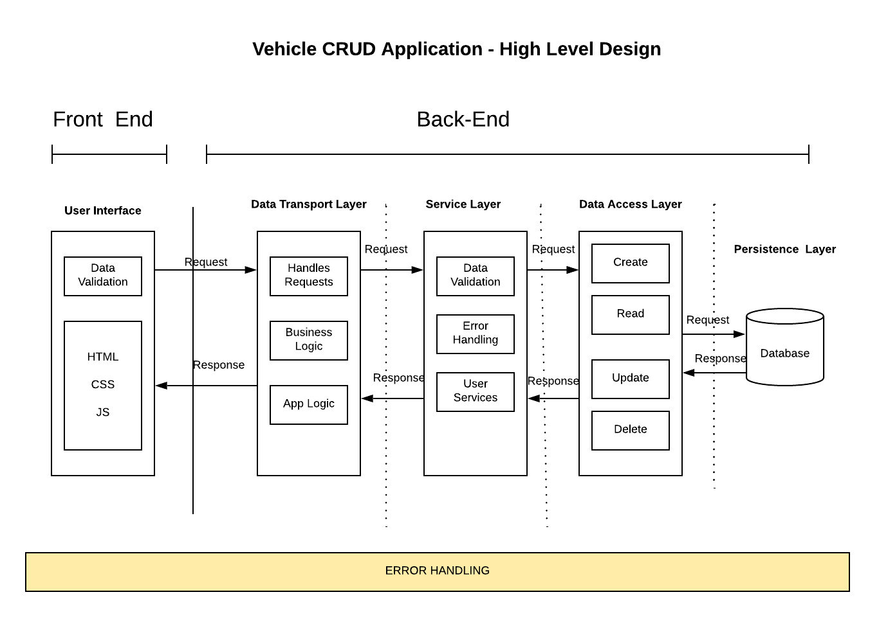

# Mitchell_Vehicle_CRUD
- This is an application containing CRUD operations : Create, Read, Update and Delete Vehicle .
- Decoupling design is applied. There are 5 layers in the design: UI, Data transport, Service, Data Access, Persistence .
- Project contains two folders: Backend application and frontend application.

#BACKEND APPLICATION 
 - Implemented using C# and .NET Framework 4.7.2
 - Database is  Microsoft SQL implemented using Code-First approach. Database will be initialized automatically with some data when building the project. 
 - For testing purpose, database will be dropped and reinitialized every time the project runs. You can disable this behavior by modifying the VehicleContext.cs file
 - Data access layer uses Entity Framework 6.
 - Data transport layer uses Web API. 
- Support data validation and error handlings 
- Unit testing for services was made using MSTest.

#FRONT END APPLICATION

- Single page application implemented using VueJS framework and Vuetify.
- Modular design with components for features.
- Axios for API requests.
- Vuex for supporting state data which is shared among components 

#HOW TO USE
-	Build and run backend application in Visual Studio 
-	Open front end app with Visual Studio Code and modify the file .env.development with your backend IP address
-	Compile and run frontend application with ‘npm run serve’ command
-	Enjoy ! Please note UI will not automatically load vehicles. Press Get All Vehicles button to do that or use Search button. There are ready some vehicles in database
-	If all search fields are empty, the request will return all vehicles.
	
